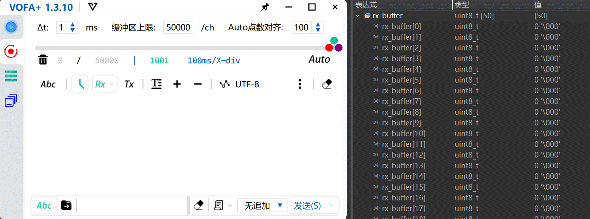
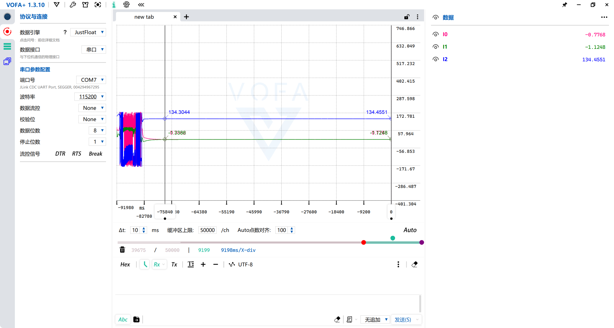
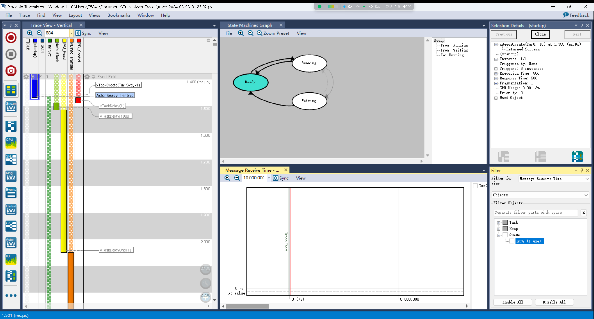

# View

SCNU 2024电控组转正考核任务

- [任务1:串口的使用](#串口的使用)
- [任务2:陀螺仪的使用](#陀螺仪的使用)
- [任务3:Can电机的使用](#can总线电机的使用)
- [任务4:PID](#pid控制电机)
- [任务5:FreeRTOS](#使用freerots进行调度)

## 串口的使用

基本要求<em><b> </b> </em>

- [x] 使用STM32F系列单片机，搭配USB转TTL（USB转串口）模块、上位机的串口调试助手等应用
- [x] 实现单片机与上位机的通信

要求细则<em><b> </b> </em>

- [x] 单片机端不限制展示信息的形式，甚至可以在Debug界面展示
- [x] 实现不定长数据接收，并显示本次接收的信息的长度
- [x] 采用非轮询等占用单片机资源的方法

- 采用DMA中断回调方式回传串口数据和数据长度如下：

## 陀螺仪的使用

基本要求<em><b> </b> </em>

- [x] 使用STM32F系列单片机，搭配MPU6050/MPU6500/IMU088等陀螺仪
- [x] 使用IIC或SPI协议与之通信，读取信息
- [x] 不能使用封装好的、带滤波的模块

要求细则<em><b> </b> </em>

- [x] 读取到全部六项信息（Pitch, yaw, roll角度， x, y, z加速度）
- [x] 采用任何形式的滤波算法且效果非负面
- [x] 在机器人一般工况下每分钟x轴或y轴角度偏移不超过10度

实现方法<em><b> </b> </em>

- [x] ~~融合九轴数据（陀螺仪+加速度计+磁力计）~~ 融合六轴数据 （陀螺仪+加速度计）

- [x] 采用MahonyAHRS（一阶互补滤波算法）对姿态传感器数据进行融合

- 原始数据读取

- MahonyAHRS解算欧拉角数据分析（仅对陀螺仪进行去零漂，静止状态下yaw角一分钟飘2度左右）

- MahonyAHRS解算欧拉角3d演示

## CAN总线电机的使用

基本要求<em><b> </b> </em>

- [x] 实现对电机正反转的控制
- [x] 实现对电机转速等信息的实时读取
- [x] 电机转速不起飞

- 演示省略

## PID控制电机

基本要求<em><b> </b> </em>

- 速度环：
  - [x] 稳态误差不超10%
  - [x] 上升时间不超过0.6秒
  - [x] 最大超调量20%
- 角度环：
  - [x] 稳态误差不超20%
  - [x] 上升时间不超过1秒
  - [x] 最大超调量10%

- 角度环测试：（**位置式PID**）
  - **无负载的正弦式**角度变化测试：

  

  
  

  - **有负载的正弦式**角度变化测试：
  

  
  

  - **无负载的阶跃式**角度变化测试：
  

  
  

  - **有负载的阶跃式**角度变化测试：
  

  
  

- 速度环测试：（**增量式PID**）
  - **无负载的正弦式**速度变化测试：

  

  
  

  - **有负载的正弦式**速度变化测试：

  

  
  

  - **无负载的阶跃式**速度变化测试：

  

  
  

  - **有负载的阶跃式**速度变化测试：
  

  
  

## 使用FreeROTS进行调度
- 基本要求
  - [x] FreeRTOS实现上述任务调度

- TraceAlyzer监测系统任务调度情况：
  

  
  

#[相关测试数据集](./dataset)