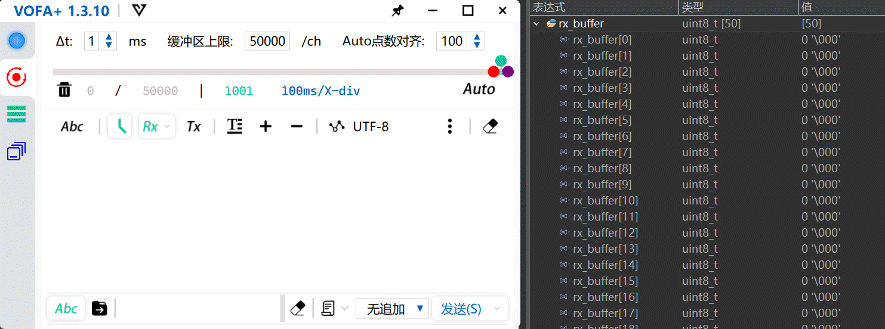

# View

SCNU 2024电控组转正考核任务

## 串口的使用

基本要求<em><b> </b> </em>

- 使用STM32F系列单片机，搭配USB转TTL（USB转串口）模块、上位机的串口调试助手等应用
- 实现单片机与上位机的通信

要求细则<em><b> </b> </em>

- 单片机端不限制展示信息的形式，甚至可以在Debug界面展示
- 实现不定长数据接收，并显示本次接收的信息的长度
- 采用非轮询等占用单片机资源的方法

<!--调整图片大小并居中显示-->

## 陀螺仪的使用

基本要求<em><b> </b> </em>

- 使用STM32F系列单片机，搭配MPU6050/MPU6500/IMU088等陀螺仪
- 使用IIC或SPI协议与之通信，读取信息
- 不能使用封装好的、带滤波的模块

要求细则<em><b> </b> </em>

- 读取到全部六项信息（Pitch, yaw, roll角度， x, y, z加速度）
- 采用任何形式的滤波算法且效果非负面
- 在机器人一般工况下每分钟x轴或y轴角度偏移不超过10度

任务实现方法

- 融合九轴数据（陀螺仪+加速度计+磁力计）
- 采用MahonyAHRS（一阶互补滤波算法）对姿态传感器数据进行融合

## CAN总线电机的使用
